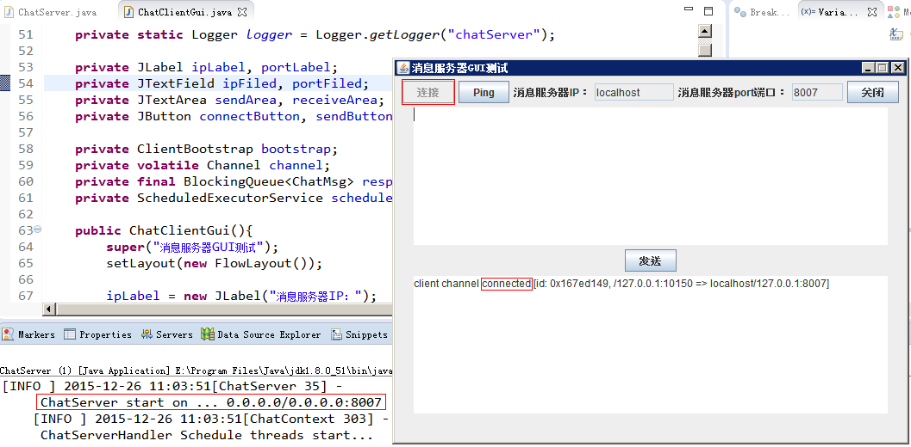
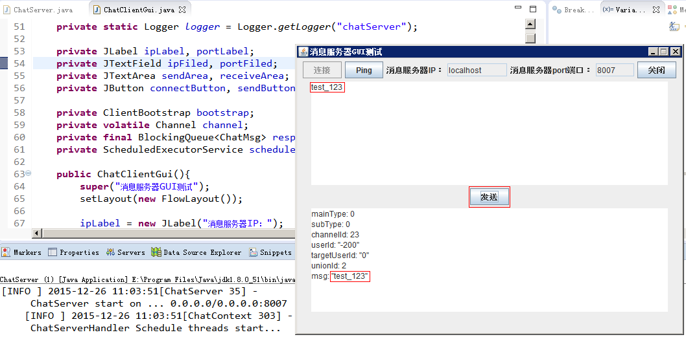
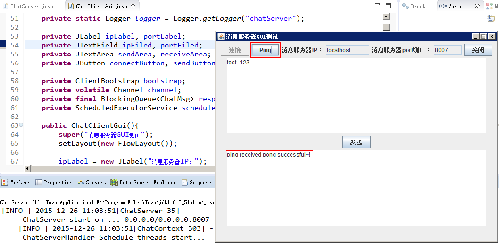
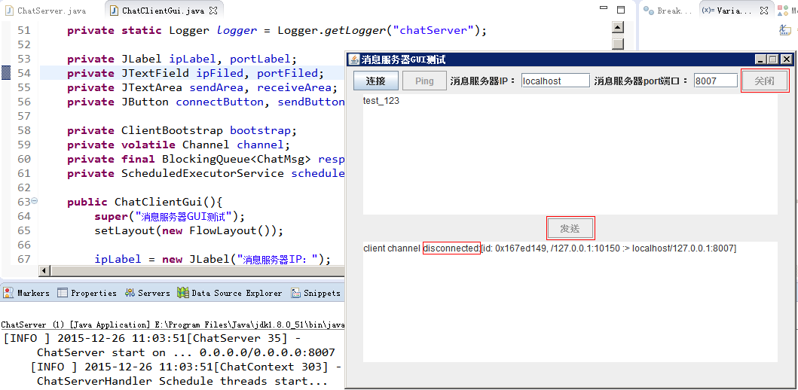

# nettyProtobufChat
netty3.2.5.Final and protobuf2.4.0a for console/gui/web chat

## Step
1. clone URI
2. mvn clean compile -e
3. mvn eclipse:eclipse

## Maven
> mvn -v

Apache Maven 2.2.1 (r801777; 2009-08-07 03:16:01+0800)  
Java version: 1.8.0_51  
Java home: E:\Program Files\Java\jdk1.8.0_51\jre  
Default locale: zh_CN, platform encoding: GBK  
OS name: "windows 7" version: "6.1" arch: "amd64" Family: "dos"

## Example
1. Run **ChatServer.java**
2. Run **ChatClientGui.java**

### connect

### sendMsg

### ping

### disconnect
